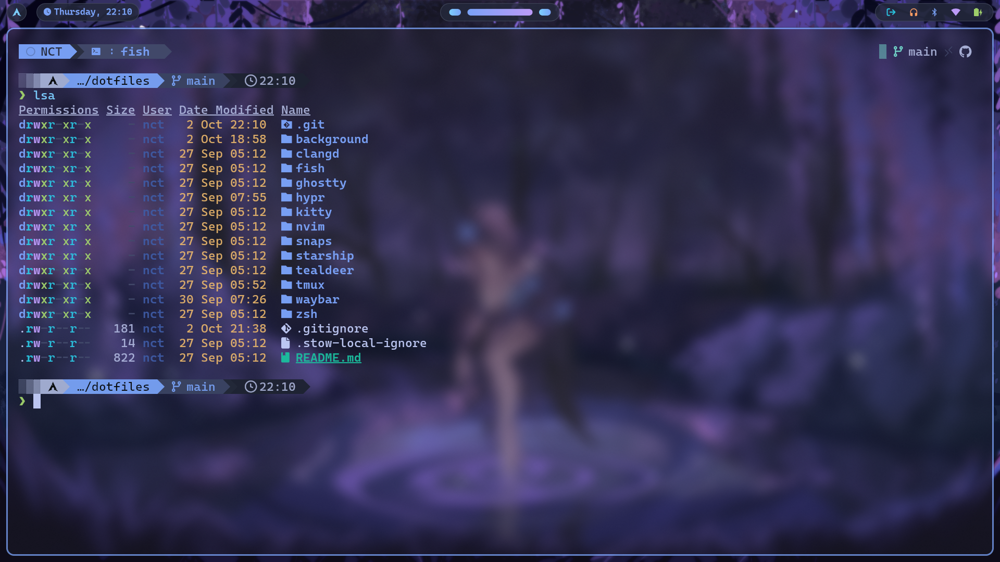
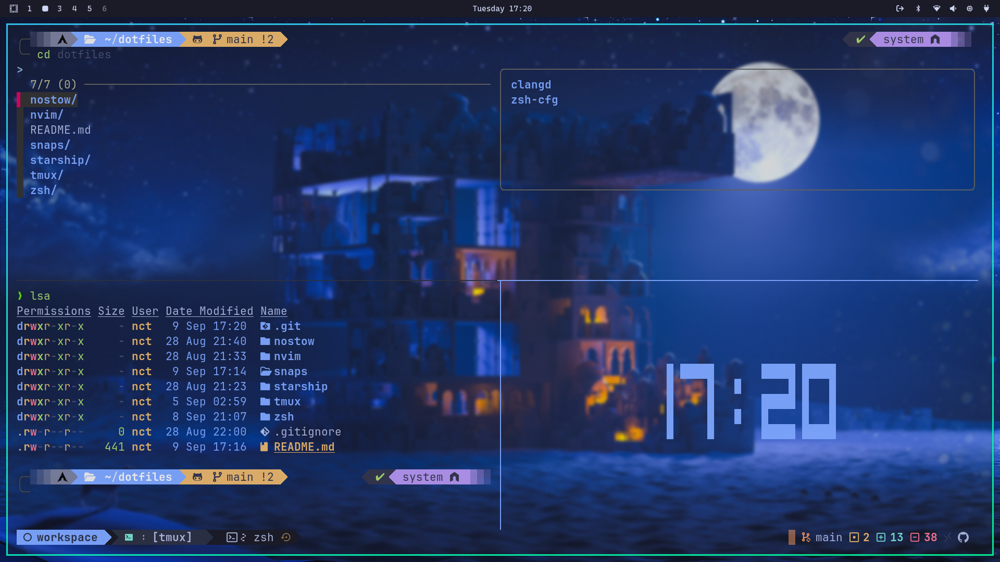

# 🛠️ Dotfiles

## 📌 Overview

Personal configuration files for **Neovim**, **Zsh**, **tmux**, and **Starship**.

Managed with [GNU Stow](https://www.gnu.org/software/stow/) for easy symlink handling, making it simple to synchronize environments across multiple machines.






## 📦 Requirements

Make sure the following tools are installed:

- `nvim`
- `zsh` or `fish`
- `tmux`
- `Oh-My-Zsh`
- `tpm` (tmux plugin manager)
- `stow`
- `fisher` if using fish shell

## 🚀 Installation

Clone the repository and use `stow` to set up the desired modules:

```sh
git clone https://github.com/thiennc254/dotfiles.git ~/dotfiles
cd ~/dotfiles

# Example: install Neovim, Zsh, tmux, and Starship configs
stow nvim zsh tmux starship
```
